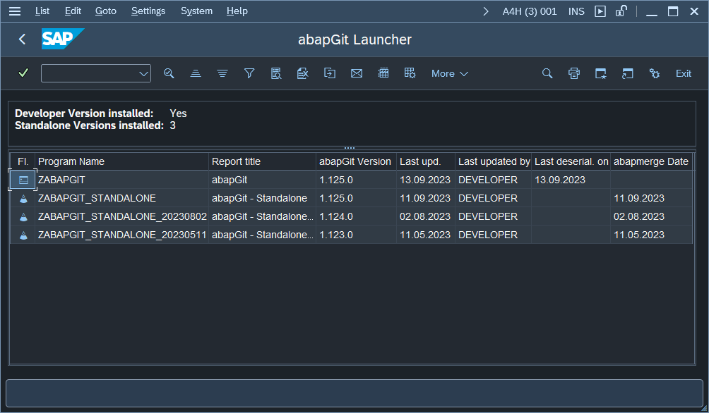

# abapGit Launcher

Launcher for multiple abapGit installations

## Functionality

This repository contains an executable program `ZAGLAUNCHER` and a transaction code of the same name. The program allows for listing and launching all abapGit installations in the system. Their respective version numbers and details on when they were last changed (updated) are included. This can be helpful when multiple installations are used in parallel in the same system.

By default the following program names / patterns are accounted for. This can be adjusted by creating / changing the variant `DEFAULT` of the report in `SE38`.

- `ZABAPGIT`
- `ZABAPGIT_STANDALONE*`
- `ZABAPGIT_FULL*`

## Installation

Install using [abapGit](https://abapgit.org) as an [online](https://docs.abapgit.org/user-guide/projects/online/install.html) or [offline](https://docs.abapgit.org/user-guide/projects/offline/install.html) repository with the default settings. The target package (for example `ZAGLAUNCHER`) cannot be a subpackage of the abapGit developer version installation.

## Requirements

\>= ABAP 7.40
